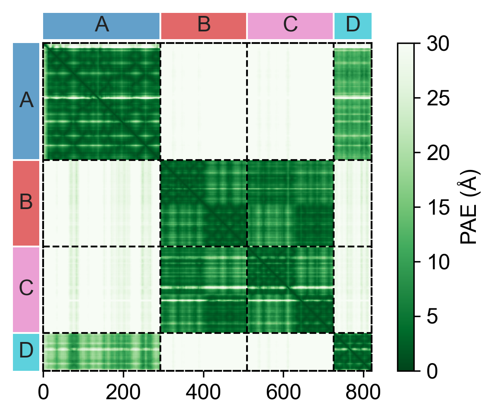

# AlphaFold3 Result Visualize

## Introduction

A convinent tool to visualize AlphaFold 3 prediction results with PyMOL and matplotlib

What can this do:
- Get a `.pml` script to help visualize including: (Work in progress)
  - pLDDT
  - Chain
  - Molecule type
  - low PAE contacts
- Get figures about: (Finished)
  - PAE

## Example

